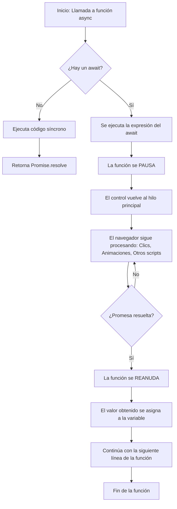
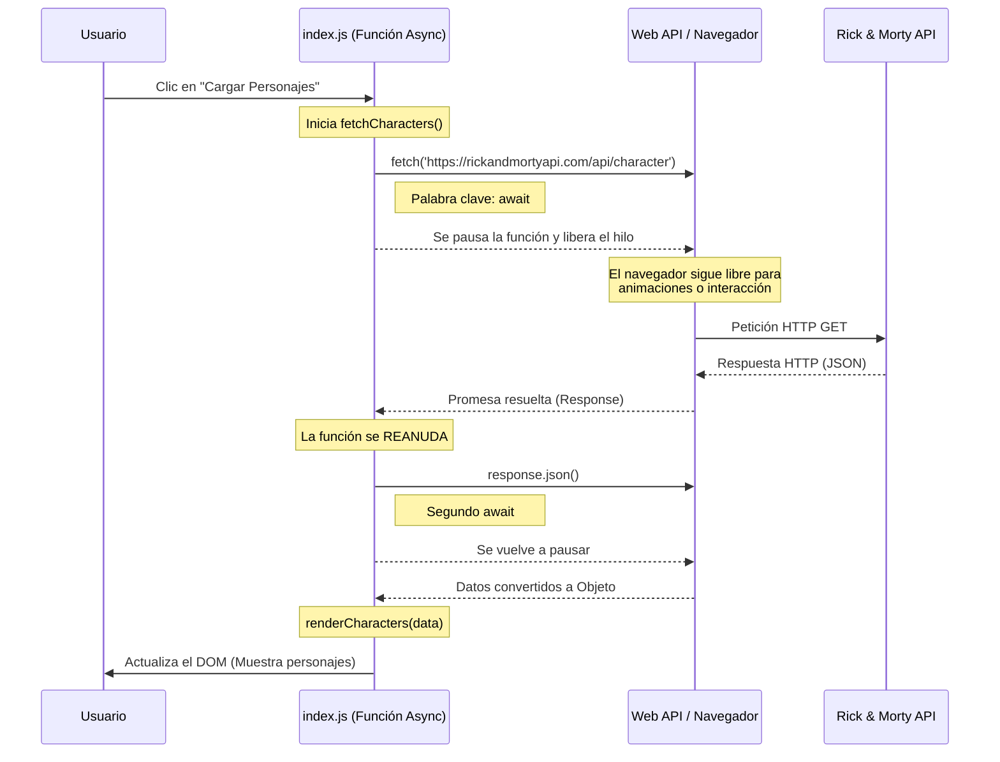

# Explicación del Async / Await en JavaScript



## Diagrama de secuencia 


# Ejemplo Consumo de APIs con fetch 

Definición del `index.html`: 

```html
<!DOCTYPE html>
<html lang="es">
<head>
    <meta charset="UTF-8">
    <title>Consumo API Fetch</title>
</head>
<body>

    <h1>Personajes de Rick and Morty</h1>
    <button id="load-characters">Cargar Personajes</button>
    
    <div id="characters-container">
        <!-- Los datos se cargarán aquí -->
    </div>

    <script src="index.js"></script>
</body>
</html>
```

Definición del `index.js`: 

```javascript 
// Referencias a los elementos del DOM
const container = document.getElementById('characters-container');
const btn = document.getElementById('load-characters');

// Función para obtener los datos de la API
const fetchCharacters = async () => {
    const url = 'https://rickandmortyapi.com/api/character';

    try {
        const response = await fetch(url);
        
        // Verificamos si la respuesta es exitosa
        if (!response.ok) {
            throw new Error(`Error en la petición: ${response.status}`);
        }

        const data = await response.json();
        renderCharacters(data.results);
    } catch (error) {
        console.error('Hubo un error:', error);
        container.innerHTML = `<p>Error al cargar los datos.</p>`;
    }
};

// Función para modificar el DOM con los resultados
const renderCharacters = (characters) => {
    // Limpiamos el contenedor antes de renderizar
    container.innerHTML = '';

    characters.forEach(character => {
        // Creamos los elementos
        const div = document.createElement('div');
        const h3 = document.createElement('h3');
        const p = document.createElement('p');
        const img = document.createElement('img');

        // Asignamos contenido
        h3.textContent = character.name;
        p.textContent = `Estado: ${character.status} - Especie: ${character.species}`;
        img.src = character.image;
        img.alt = character.name;
        img.width = 150;

        // Construimos la jerarquía
        div.appendChild(h3);
        div.appendChild(p);
        div.appendChild(img);
        
        // Inyectamos el div en el contenedor principal
        container.appendChild(div);
    });
};

// Evento de escucha para el botón
btn.addEventListener('click', fetchCharacters);
```
