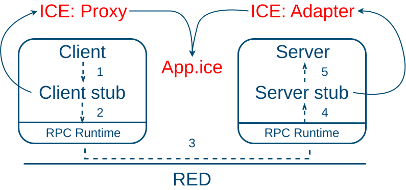
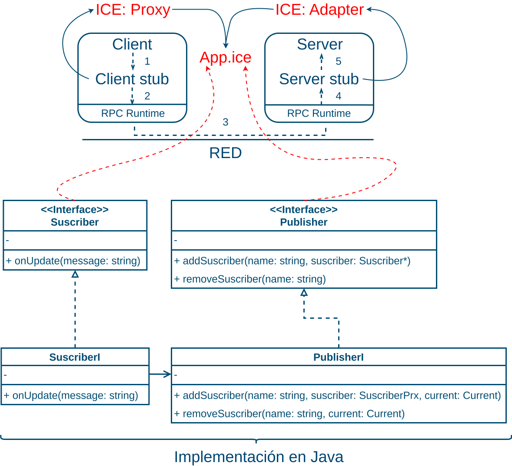

# RPC - Remote Procedure Call

La idea detrás de RPC es hacer que una llamada a un procedimiento remoto se
parezca tanto como sea posible a una llamada local, intentando apstraer las
operaciones de red a un alto nivel. En su forma más simple, para llamar a un
procedimiento remoto, el programa cliente debe estar enlazado con un pequeño
procedimiento de _biblioteca_, llamado stub del cliente, en Ice este es
conocido como un _Proxy_, que representa el procedimiento del servidor en el
espacio de direcciones del cliente. Del mismo modo, el servidor está vinculado
a un procedimiento llamado stub del servidor, en Ice es conocido como el
_Adapter_. Estos procedimientos ocultan el hecho de que la llamada al
procedimiento del cliente al servidor no es local, El siguiente diagrama
muestra un resumen de los componentes de un RPC, y como se traducen a Ice:

 _Figura 1. Descripción y
secuencia de un RPC (Con los componentes de Ice en rojo)_ Esta _biblioteca_ es
definida por medio de un  archivo .ice, el cual es definido en el lenguaje
[slice](https://doc.zeroc.com/ice/3.6/the-slice-language)

Los pasos que sigue un RPC se resumen en la figura 1. los pasos son:

- El cliente llama al client stup, en el caso de Ice llama al Ice Proxy
- El stub del cliente (Ice Proxy) empaquetando los parámetros en un mensaje y haciendo una llamada al RPC Runtime (Ice) para enviar el mensaje.
- Es el RPC Runtime (Ice) que envía el mensaje desde la máquina cliente a la máquina servidor.
- El RPC Runtime (Ice) que pasa el paquete entrante al stub del servidor (Adapter de Ice).
- El stub del servidor (Adapter de Ice)  llamando al procedimiento del servidor con los parámetros. La respuesta sigue el mismo camino en la otra dirección.
  Este repositorio tiene un ejemplo basico de la herramienta, puede consultar un ejemplo mas completo puede ir a [este tutorial](https://github.com/Cl0udX/query_dist/tree/master)

# Publisher and Suscriber in Ice with Java

### Pre-Requicitos:

Inicializar el proyecto con gradle:

```bash
$ gradle init

Select type of build to generate:
  1: Application
  2: Library
  3: Gradle plugin
  4: Basic (build structure only)
Enter selection (default: Application) [1..4] 4

Project name (default: gradle): IceExample

Select build script DSL:
  1: Kotlin
  2: Groovy
Enter selection (default: Kotlin) [1..2] 2

Generate build using new APIs and behavior (some features may change in the next minor release)? (default: no) [yes, no]


> Task :init
Learn more about Gradle by exploring our Samples at https://docs.gradle.org/8.10.2/samples

BUILD SUCCESSFUL in 23s
1 actionable task: 1 executed

$
```

Trabajar con la versión `8.5` de `gradle` para ello debe cambiar la versión del wrapper: 

```bash
./gradlew wrapper --gradle-version 8.5 && ./gradlew clean build 
```

## Estructura del proyecto: 

```bash
Proyecto
├── App.ice
├── build.gradle
├── settings.gradle
├── settings.gradle
├── client
│   ├── bin
│   │   └── main
│   │       ├── Demo
│   │       │   ├── Publisher.class
│   │       │   ├── PublisherPrx.class
│   │       │   ├── _PublisherPrxI.class
│   │       │   ├── Suscriber.class
│   │       │   ├── SuscriberPrx.class
│   │       │   └── _SuscriberPrxI.class
│   │       ├── properties.cfg
│   │       ├── properties.cfg.copy
│   │       ├── slice2java.df.xml
│   │       └── SuscriberI.class
│   └── src
│       └── main
│           ├── java
│           │   ├── Client.java
│           │   └── SuscriberI.java
│           └── resources
│               └── properties.cfg
│
└── server
    ├── bin
    │   └── main
    │       ├── Demo
    │       │   ├── Publisher.class
    │       │   ├── PublisherPrx.class
    │       │   ├── _PublisherPrxI.class
    │       │   ├── Suscriber.class
    │       │   ├── SuscriberPrx.class
    │       │   └── _SuscriberPrxI.class
    │       ├── properties.cfg
    │       ├── PublisherI.class
    │       ├── Server.class
    │       └── slice2java.df.xml
    └── src
        └── main
            ├── java
            │   ├── PublisherI.java
            │   └── Server.java
            └── resources
                └── properties.cfg

```

Configuración con `gradle`:

- build.gradle

```groovy
`/*
* This file was generated by the Gradle 'init' task.
*
* This is a general purpose Gradle build.
* Learn more about Gradle by exploring our Samples at https://docs.gradle.org/8.10.2/samples
*/
plugins {
  id 'com.zeroc.gradle.ice-builder.slice' version '1.5.0' apply false
}

subprojects {
  apply plugin: 'java'
  apply plugin: 'com.zeroc.gradle.ice-builder.slice'

  slice {
      java {
          files = [file("../App.ice")]
      }
  }

  repositories {
      mavenCentral()
  }

  dependencies {
      implementation 'com.zeroc:ice:3.7.4'
  }

  tasks.register('copyIceJar', Copy) {
        from configurations.runtimeClasspath
        include 'ice-3.7.4.jar'
        into layout.buildDirectory.dir("libs")
        duplicatesStrategy = DuplicatesStrategy.EXCLUDE
  }

  jar {
      dependsOn 'copyIceJar'
      manifest {
          attributes(
              "Main-Class": project.name.capitalize(),
              "Class-Path": configurations.runtimeClasspath.collect { it.name }.join(' ')
          )
      }
  }
}

``

- settings.gradle

```groovy
  rootProject.name = 'ProjectName'
  include 'client'
  include 'server'
  ```

  ### Arquitectura con Ice:

  
  App.ice

  ```groovy
  module Demo {
    interface Suscriber {
        void onUpdate(string s);
    }
    interface Publisher {
        void addSuscriber(string name, Suscriber* o);
        void removeSuscriber(string name);
    }
  }
```

### Server:

- server/src/main/java/PublisherI.java

```java
  /**
        Definición                   Definición
            en                          en
           Java                         Ice
            ^                            ^
            |                            |
    +-------------+             +----------------+
    | PublisherI  | ---------|> | Demo.Publisher |
    +-------------+             +----------------+
  */
import com.zeroc.Ice.Current;
import java.util.*;
import Demo.*;
import Demo.SuscriberPrx;
import Demo.PublisherPrx;

public class PublisherI implements Demo.Publisher {

        private HashMap<String, SuscriberPrx>
            suscribers;

        public PublisherI(){
            suscribers = new HashMap<>();
        }

        @Override
        public void addSuscriber(String name, SuscriberPrx suscriber, Current current){
            System.out.println("New Suscriber: ");
            suscribers.put(name, suscriber);
        }

        @Override
        public void removeSuscriber(String name, Current current){
            suscribers.remove(name);
        }

        public void notifySuscriber(String name,String msg){
            SuscriberPrx suscriber = suscribers.get(name);
            suscriber.onUpdate(msg);
        }
    }

```

- Server: server/src/main/java/Server.java

```java
import java.io.BufferedReader;
import java.io.IOException;
import java.io.InputStreamReader;

import com.zeroc.Ice.*;

public class Server{
    public static void main(String[] args) {

        try(Communicator communicator
                = Util.initialize(args,
                    "properties.cfg")){

            ObjectAdapter adapter =
                communicator
                .createObjectAdapter("services");

            PublisherI publisher = new PublisherI();

            adapter.add(publisher,
                    Util.stringToIdentity("Publisher"));
            adapter.activate();

            BufferedReader reader = new BufferedReader(new InputStreamReader(System.in));
            String msj = "";

            System.out.println("Type a message in format NameSuscribe::Message");
            while ((msj = reader.readLine()) != null) {
                if(!msj.contains("::")){
                    System.out.println("Incorrect format ");
                    continue;
                }
                String[] command = msj.split("::");
                publisher.notifySuscriber(command[0], command[1]);

            }
            reader.close();
            communicator.waitForShutdown();
        }
        catch(IOException e){
            e.printStackTrace();
        }
    }
}

```

- server/src/main/resources/properties.cfg

```groovy
services.Endpoints=default -h localhost -p 5000
```

### Cliente:

- client/src/main/java/Client.java

```java
import java.io.BufferedReader;
import java.io.IOException;
import java.io.InputStreamReader;

import com.zeroc.Ice.*;

import Demo.*;

public class Client {
    public static void main(String[] args) {
        try(Communicator communicator
                = Util.initialize(args,
                    "properties.cfg")) {

            Suscriber suscriber = new SuscriberI();

            ObjectAdapter adapter =
                communicator
                .createObjectAdapter("Suscriber");

            ObjectPrx proxys = adapter
                .add(suscriber,
                        Util.stringToIdentity("NN"));

            adapter.activate();

            SuscriberPrx suscriberPrx =
                SuscriberPrx.checkedCast(proxys);

            PublisherPrx publisher =
                PublisherPrx.checkedCast(
                        communicator
                        .propertyToProxy(
                            "publisher.proxy"));

            if(publisher == null){
                throw new Error("Bat Ice Proxy");
            }

            BufferedReader reader = new BufferedReader(new InputStreamReader(System.in));
            System.out.println("Type a User name: ");
            String name = reader.readLine();

            publisher.addSuscriber(name, suscriberPrx);
            communicator.waitForShutdown();
        }
        catch(IOException e){
            e.printStackTrace();
        }
    }
}
```

- client/src/main/java/SuscriberI.java

```java
  /**
        Definición                   Definición
            en                          en
           Java                         Ice
            ^                            ^
            |                            |
    +-------------+             +----------------+
    | SuscriberI  | ---------|> | Demo.Suscriber |
    +-------------+             +----------------+
  */
import com.zeroc.Ice.*;

public class SuscriberI implements Demo.Suscriber {

    @Override
    public void onUpdate(String msg, Current current){
        System.out.println(msg);
    }
}

```

- client/src/main/resources/properties.cfg

```groovy
Suscriber.Endpoints = default -p 6001 -h  0.0.0.0
publisher.proxy = Publisher:default -p 5000 -h localhost
```

### Compilación:

El proyecto se puede compilar con gradlew

```bash
# Run gradlew build
$ ./gradlew build
```

Esto generará el ejecutable en el directorio *server/build/libs/*

```bash
$ ls server/build/libs/
gson-2.10.1.jar  ice-3.7.4.jar  server.jar
```

### Ejecución:

Desde el server:

```bash
java -jar server/build/libs/server.jar
```

Desde el cliente:

```bash
java -jar client/build/libs/client.jar
```

# Cambios para ejecución de Múltiples Clientes

- client/bin/main/properties.cfg

```groovy
Suscriber.Endpoints = default -p <Client-Port>
publisher.proxy = Publisher:default -p 5000 -h <Server-IP>
```

- server/src/main/resources/properties.cfg

```groovy
services.Endpoints=default -h 0.0.0.0 -p <Server-IP>
```
